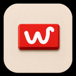

# Whirl

[](https://github.com/baiyanwu/Whirl/actions/workflows/ci.yml)
[](https://github.com/baiyanwu/Whirl/actions/workflows/codeql.yml)
[](LICENSE)



Whirl is a native macOS 26 launcher and same-app window switcher for Apple silicon. It keeps app launching, app switching, and window switching on one configurable modifier key.

## Highlights

- Choose Option, Command, Shift, or Control as the switching modifier; either physical key works.
- Use `Modifier + A–Z/0–9` to launch or switch to a configured app. Repeating the shortcut while the app is frontmost hides it.
- Hold the selected modifier to reveal the app bar.
- Double-tap the selected modifier to reveal the current app's standard windows.
- Confirm the highlighted window with Space or Enter, or press 1–9 to select a numbered window directly.
- Run entirely as a menu bar utility, with a full settings window and first-run guide.
- Use Whirl in English or Simplified Chinese.

## Requirements

- An Apple silicon Mac
- macOS 26 or later
- Xcode 26 or later to build from source
- [XcodeGen](https://github.com/yonaskolb/XcodeGen) 2.45 or later when changing `project.yml`

There is no supported Intel build. `ARCHS` is intentionally restricted to `arm64`.

## Permissions and privacy

Regular app shortcuts use the macOS hot-key API. Long-press and double-press recognition observe only the selected modifier's state changes. Neither path requires Input Monitoring.

Accessibility access is used only to enumerate, focus, or switch windows and compatible app tabs after a double press. Whirl contains no analytics or network client code, and its settings stay in local `UserDefaults`. See [PRIVACY.md](PRIVACY.md) for the complete data-handling statement.

## Build from source

Clone the repository and build the checked-in Xcode project:

```sh
git clone https://github.com/baiyanwu/Whirl.git
cd Whirl
xcodebuild \
  -project Whirl.xcodeproj \
  -scheme Whirl \
  -configuration Debug \
  -derivedDataPath .build/RunDerivedData \
  build
open .build/RunDerivedData/Build/Products/Debug/Whirl.app
```

The Debug configuration is signed locally so macOS can launch it and associate privacy permissions with the app. Do not launch a `CODE_SIGNING_ALLOWED=NO` product. Without an Apple Development certificate, every rebuild receives a new ad-hoc code identity; remove or toggle the old Whirl entry in Privacy & Security, authorize the new build, and restart it. Selecting an Apple Development team in Xcode gives development builds a stable identity.

If you change `project.yml`, regenerate and commit the Xcode project:

```sh
xcodegen generate
git diff -- Whirl.xcodeproj
```

## Test

The `Whirl` scheme contains deterministic unit tests and works without a signing certificate:

```sh
xcodebuild \
  -project Whirl.xcodeproj \
  -scheme Whirl \
  -configuration Debug \
  -derivedDataPath .build/TestDerivedData \
  CODE_SIGNING_ALLOWED=NO \
  test
```

macOS UI automation requires the app, UI-test bundle, and test runner to share a valid Apple Development team signature. After selecting a team, run:

```sh
xcodebuild \
  -project Whirl.xcodeproj \
  -scheme WhirlUITests \
  DEVELOPMENT_TEAM=YOUR_TEAM_ID \
  test
```

Do not disable code signing for the UI-test command. An unsigned or ad-hoc UI-test runner is rejected because the runner and injected test bundle do not share a Team ID.

## Repository layout

```text
Whirl/          Application source and resources
WhirlTests/     Deterministic unit tests
WhirlUITests/   Signed macOS UI tests
script/         Local build-and-run entry point
scripts/        Icon, archive, signing, notarization, and release tools
release/        Export configuration; generated artifacts stay ignored
project.yml     Source of truth for the generated Xcode project
```

## Release

Official binary releases start from annotated `vX.Y.Z` tags. GitHub Actions verifies the tagged source without receiving signing credentials. A maintainer then rebuilds that exact tag locally, signs with a Developer ID identity held only in the local Keychain, notarizes with Apple, verifies Gatekeeper acceptance and SHA-256 integrity, and publishes the verified assets. The repository deliberately does not publish an unsigned end-user build. Maintainers should follow [docs/RELEASING.md](docs/RELEASING.md).

## Contributing and support

Read [CONTRIBUTING.md](CONTRIBUTING.md) before opening a pull request. Use [GitHub Discussions](https://github.com/baiyanwu/Whirl/discussions) for questions, and the issue forms for reproducible bugs or focused feature requests. Security reports must follow [SECURITY.md](SECURITY.md).

## License

Whirl is available under the [MIT License](LICENSE).
